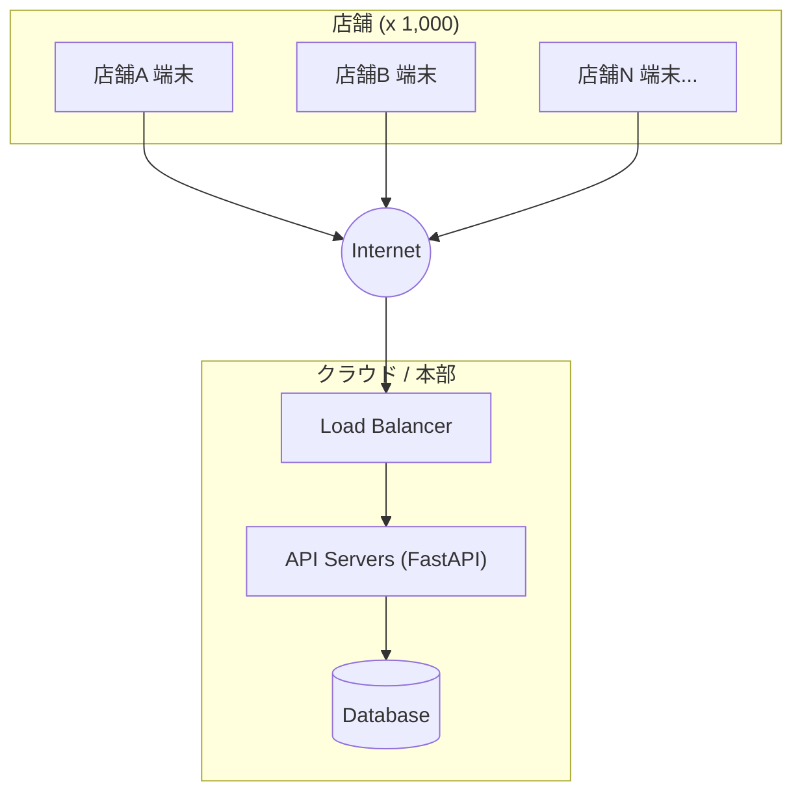

# システムアーキテクチャ概要

本プロジェクト（Food Ticket System Ver2）のアーキテクチャ設計と、将来的な大規模展開（1,000店舗規模）を見据えたスケーラビリティへの考慮事項について記述します。

## 1. 全体構成

本システムは、**中央集中型のWeb API構成**を採用しています。

- **Frontend (キオスク端末)**
    - 各店舗の端末（タブレット/PC）で動作するSPA (Single Page Application)。
    - 店舗内にサーバーは持たず、インターネット経由でクラウド上のBackend APIにアクセスします。
    - 主な責務: UI表示、周辺機器（プリンタ等）連携、API通信。

- **Backend (API Server + Database)**
    - クラウド（AWS/GCP等）または本部に配置。
    - 全店舗からのリクエストを一元管理。
    - 主な責務: ビジネスロジック、データ永続化、認証、在庫管理。

## 2. 大規模展開時の課題と対策 (スケーラビリティ)

全国1,000店舗規模での運用を想定した場合、ランチタイムなどのピーク時に大量のトランザクション（秒間数千リクエスト）が発生します。これに対する負荷分散策は以下の通りです。

### A. アプリケーションサーバーの負荷分散 (Compute)
現在のFastAPI実装はステートレス（サーバー自体に状態を持たない）に設計されているため、容易にスケールアウトが可能です。

- **対策**: `Load Balancer` 配下にAPIサーバー（コンテナ）を数十〜数百台並列に配置し、リクエストを分散させます。

### B. データベースの負荷分散 (Storage)
単一のデータベースへの書き込み集中がボトルネックとなる可能性があります。

- **Read Replica (読み取り専用)**:
    - メニュー表示などの「参照系」リクエストは、複製されたRead Replicaに流すことで、Master DBの負荷を軽減します。
- **Sharding (水平分割)**:
    - 負荷が限界を超えた場合、店舗IDなどをキーにしてデータベースを物理的に分割（例: 東日本DB、西日本DB）します。

### C. キャッシュ戦略 (Caching)
- **Redis等の活用**:
    - メニュー情報や店舗マスタなど、頻繁に変更されないデータはインメモリキャッシュ（Redis/Memcached）に保持し、DBへのアクセスを最小限に抑えます。

## 3. オフライン対策（今後の検討課題）
中央集中型における最大のリスクはインターネット回線の切断です。

- **対策案**: フロントエンド側に `Service Worker` や `IndexedDB` を用いた一時的なオフライン稼働機能を実装し、回線復旧時にバックエンドと同期する仕組み（Store-and-Forward）の導入を検討します。
