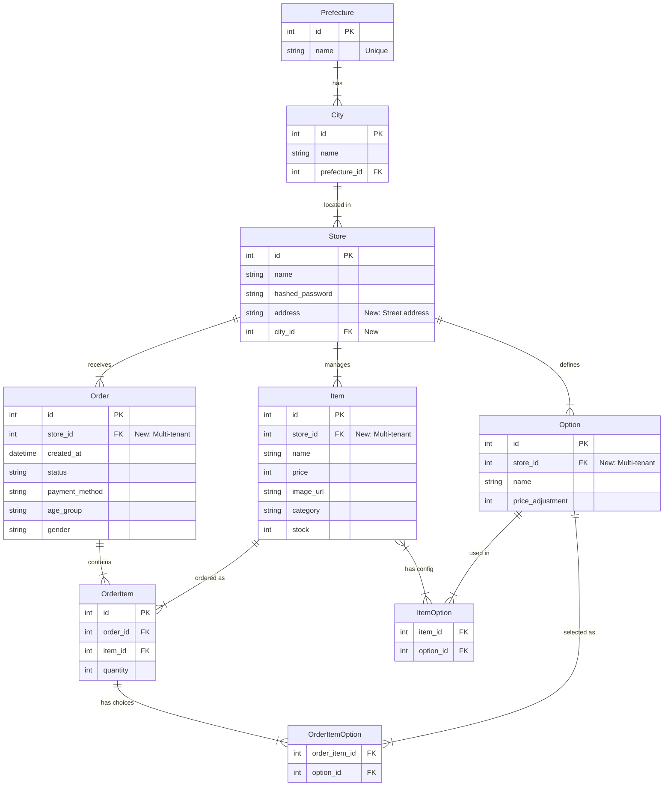

# データベースER図 (改修案)

ユーザー要望に基づく改修案です。
- 都道府県・市町村マスタの追加
- 店舗への住所・市町村紐づけ
- 店舗ごとのデータ管理 (Multi-tenancy)

## 変更点概要

### 1. マスタデータの追加
- **Prefecture** (都道府県)
- **City** (市町村): `prefecture_id` を持ち、都道府県に属する。

### 2. 店舗情報の拡張
- **Store**:
    - `city_id`: 市町村への外部キー。
    - `address`: 詳細住所カラムを追加。

### 3. マルチテナント化 (データ分離)
以下のテーブルに `store_id` を追加し、店舗ごとのデータを管理できるようにします。
- **Item**: 商品は店舗ごとに定義。
- **Order**: 注文は特定の店舗に対して行われる。
- **Option**: オプション（トッピング等）も店舗ごとに定義できるように変更（※要件には明示されていませんが、商品が店舗別ならオプションも店舗別であるべきため）。
