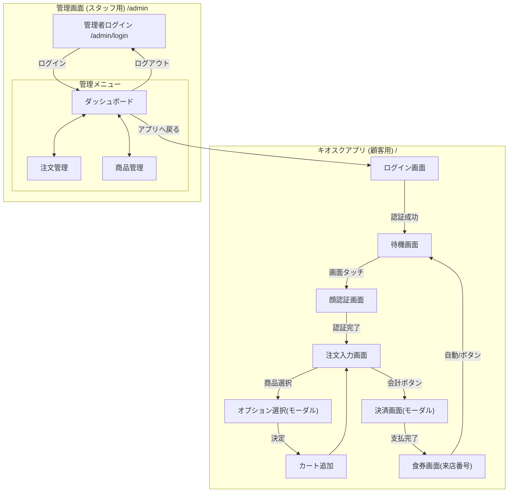

# 画面遷移図

```mermaid
graph TD
    %% キオスクアプリ (顧客・店舗端末)
    subgraph Kiosk["キオスクアプリ (顧客用) /"]
        K_Login["ログイン画面"] -->|認証成功| K_Standby["待機画面"]
        K_Standby -->|画面タッチ| K_FaceAuth["顔認証画面"]
        K_FaceAuth -->|認証完了| K_Ordering["注文入力画面"]
        
        %% 注文フロー
        %% 注文フロー
        K_Ordering -->|商品選択| K_Option["オプション選択(モーダル)"]
        K_Option -->|決定| K_Cart["カート追加"]
        K_Cart --> K_Ordering
        K_Ordering -->|会計ボタン| K_Payment["決済画面(モーダル)"]
        K_Payment -->|支払完了| K_Ticket["食券画面(来店番号)"]
        K_Ticket -->|自動/ボタン| K_Standby
    end

    %% 管理画面 (スタッフ用)
    subgraph Admin["管理画面 (スタッフ用) /admin"]
        A_Login["管理者ログイン /admin/login"] -->|ログイン| A_Dashboard["ダッシュボード"]
        
        %% サイドバーナビゲーション
        subgraph AdminNav["管理メニュー"]
            A_Dashboard <--> A_Orders["注文管理"]
            A_Dashboard <--> A_Items["商品管理"]
        end
        
        A_Dashboard -->|ログアウト| A_Login
        A_Dashboard -->|アプリへ戻る| K_Login
    end
```
